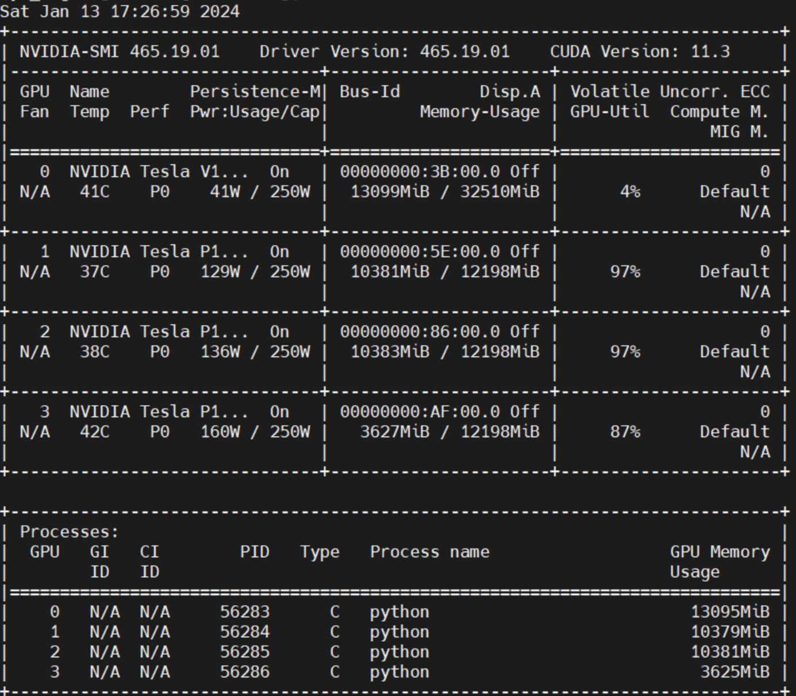
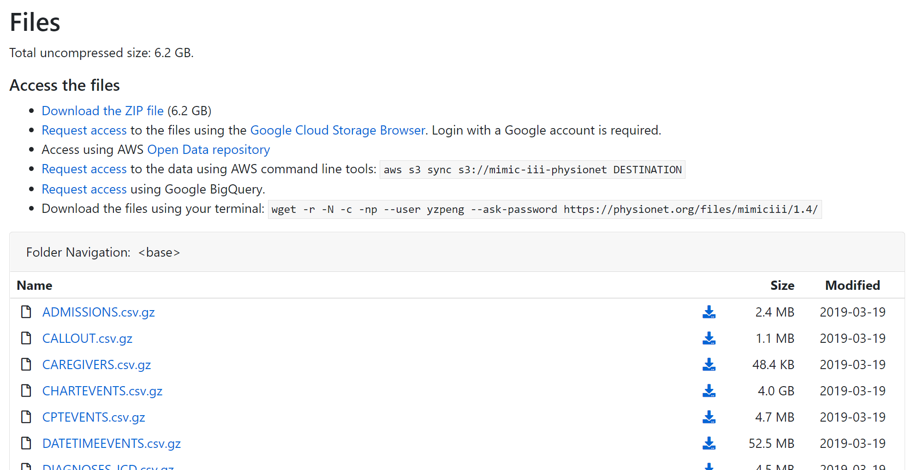

# FedMM-D

FedMM Research Project (Provably), advised by Dr. Jie Xu. You are also welcome to share your ideas by opening an issue or dropping me an email at [ypeng@miami.edu](mailto:ypeng@miami.edu).



You can access the ModelNet-40 data [here](https://modelnet.cs.princeton.edu/).

You can access the (full) Mimic-III data [here](https://physionet.org/content/mimiciii/1.4/). Download the files using your terminal with the following command:

```bash
wget -r -N -c -np --user yzpeng --ask-password https://physionet.org/files/mimiciii/1.4/
